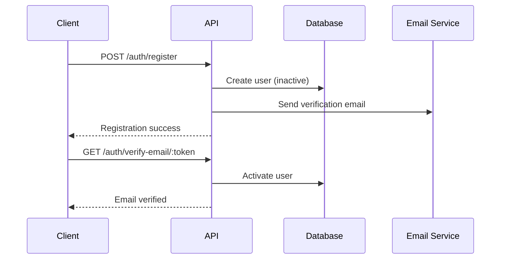
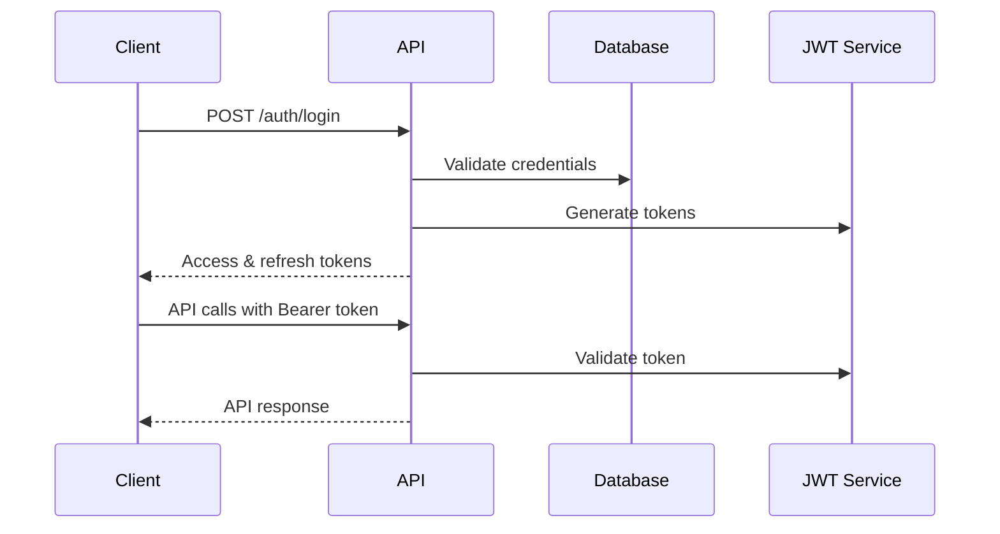
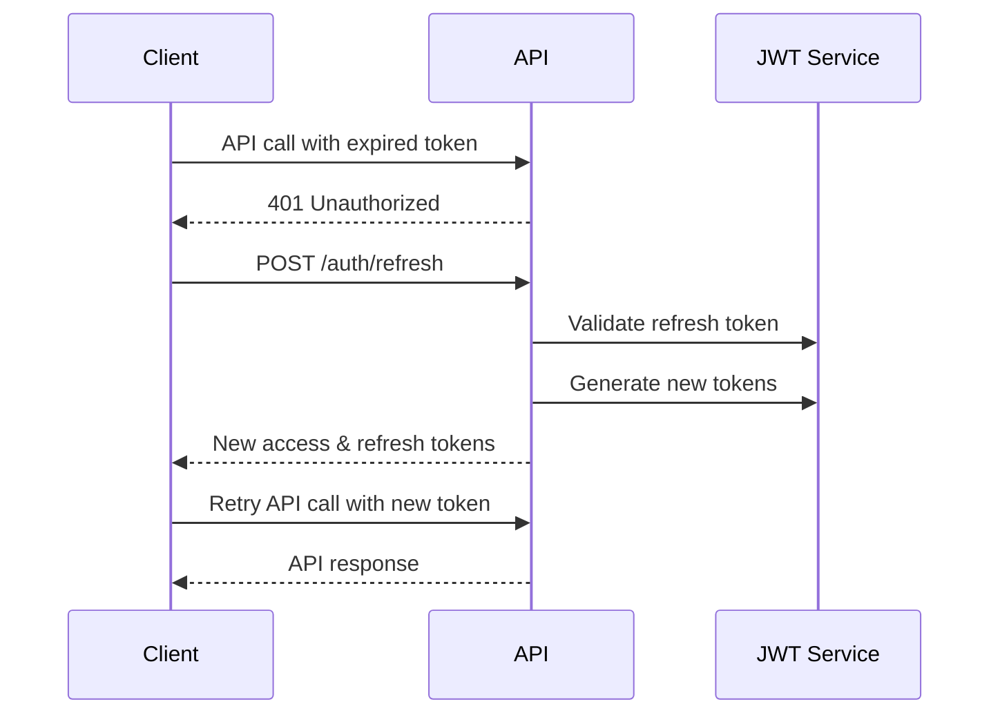

# Authentication API

## Overview

The Authentication API provides endpoints for user authentication, registration, password management, and token handling.

**Base Path**: `/api/v1/auth`

## Endpoints

### POST /auth/login

Authenticate a user and receive access and refresh tokens.

**Request Body:**
```json
{
  "email": "user@example.com",
  "password": "securePassword123"
}
```

**Response (200):**
```json
{
  "success": true,
  "data": {
    "user": {
      "id": "user-id",
      "email": "user@example.com",
      "firstName": "John",
      "lastName": "Doe",
      "isActive": true,
      "roles": [
        {
          "id": "role-id",
          "name": "user",
          "permissions": ["read:profile"]
        }
      ]
    },
    "tokens": {
      "accessToken": "jwt-access-token",
      "refreshToken": "jwt-refresh-token",
      "expiresIn": 3600
    }
  },
  "timestamp": "2025-07-10T11:00:00.000Z"
}
```

**Error Responses:**
- `400`: Invalid request data
- `401`: Invalid credentials
- `429`: Too many login attempts

---

### POST /auth/register

Register a new user account.

**Request Body:**
```json
{
  "email": "newuser@example.com",
  "password": "securePassword123",
  "confirmPassword": "securePassword123",
  "firstName": "Jane",
  "lastName": "Smith"
}
```

**Response (201):**
```json
{
  "success": true,
  "data": {
    "user": {
      "id": "new-user-id",
      "email": "newuser@example.com",
      "firstName": "Jane",
      "lastName": "Smith",
      "isActive": false,
      "emailVerified": false
    },
    "message": "Registration successful. Please check your email for verification."
  },
  "timestamp": "2025-07-10T11:00:00.000Z"
}
```

**Error Responses:**
- `400`: Invalid request data
- `409`: Email already exists
- `422`: Validation errors

---

### POST /auth/refresh

Refresh an access token using a refresh token.

**Request Body:**
```json
{
  "refreshToken": "jwt-refresh-token"
}
```

**Response (200):**
```json
{
  "success": true,
  "data": {
    "accessToken": "new-jwt-access-token",
    "refreshToken": "new-jwt-refresh-token",
    "expiresIn": 3600
  },
  "timestamp": "2025-07-10T11:00:00.000Z"
}
```

**Error Responses:**
- `400`: Invalid refresh token
- `401`: Refresh token expired

---

### POST /auth/logout

Logout user and invalidate tokens.

**Headers:**
```
Authorization: Bearer <access-token>
```

**Request Body:**
```json
{
  "refreshToken": "jwt-refresh-token"
}
```

**Response (200):**
```json
{
  "success": true,
  "message": "Logout successful",
  "timestamp": "2025-07-10T11:00:00.000Z"
}
```

---

### POST /auth/forgot-password

Request a password reset email.

**Request Body:**
```json
{
  "email": "user@example.com"
}
```

**Response (200):**
```json
{
  "success": true,
  "message": "Password reset email sent",
  "timestamp": "2025-07-10T11:00:00.000Z"
}
```

**Error Responses:**
- `400`: Invalid email format
- `404`: Email not found
- `429`: Too many reset requests

---

### POST /auth/reset-password

Reset password using a reset token.

**Request Body:**
```json
{
  "token": "password-reset-token",
  "password": "newSecurePassword123",
  "confirmPassword": "newSecurePassword123"
}
```

**Response (200):**
```json
{
  "success": true,
  "message": "Password reset successful",
  "timestamp": "2025-07-10T11:00:00.000Z"
}
```

**Error Responses:**
- `400`: Invalid or expired token
- `422`: Password validation errors

---

### GET /auth/verify-email/:token

Verify user email address.

**Parameters:**
- `token` (path): Email verification token

**Response (200):**
```json
{
  "success": true,
  "message": "Email verified successfully",
  "timestamp": "2025-07-10T11:00:00.000Z"
}
```

**Error Responses:**
- `400`: Invalid or expired token
- `404`: Token not found

## Authentication Flow

### 1. Registration Flow


### 2. Login Flow


### 3. Token Refresh Flow


## Security Considerations

### Password Requirements
- Minimum 8 characters
- At least one uppercase letter
- At least one lowercase letter
- At least one number
- At least one special character

### Token Security
- **Access Token**: Short-lived (1 hour)
- **Refresh Token**: Long-lived (7 days)
- **Reset Token**: Short-lived (15 minutes)
- **Verification Token**: Medium-lived (24 hours)

### Rate Limiting
- Login attempts: 5 per minute per IP
- Registration: 3 per minute per IP
- Password reset: 2 per minute per IP
- Email verification: 1 per minute per IP

### Account Security
- Account lockout after 5 failed login attempts
- Password history (prevents reusing last 5 passwords)
- Email verification required for new accounts
- Secure password reset flow with time-limited tokens

## Error Codes

| Code | Description |
|------|-------------|
| `AUTH_INVALID_CREDENTIALS` | Invalid email or password |
| `AUTH_ACCOUNT_LOCKED` | Account locked due to failed attempts |
| `AUTH_ACCOUNT_INACTIVE` | Account not activated |
| `AUTH_EMAIL_NOT_VERIFIED` | Email address not verified |
| `AUTH_TOKEN_EXPIRED` | JWT token has expired |
| `AUTH_TOKEN_INVALID` | JWT token is invalid |
| `AUTH_REFRESH_TOKEN_INVALID` | Refresh token is invalid |
| `AUTH_PASSWORD_WEAK` | Password doesn't meet requirements |
| `AUTH_EMAIL_EXISTS` | Email already registered |
| `AUTH_RESET_TOKEN_INVALID` | Password reset token invalid |
| `AUTH_VERIFICATION_TOKEN_INVALID` | Email verification token invalid |
