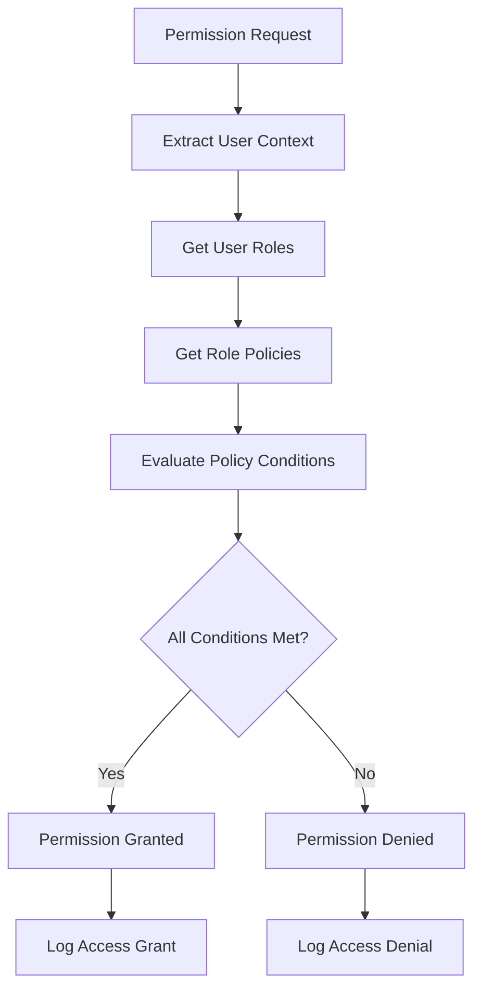

# Permissions API

## Overview

The Permissions API provides endpoints for checking user permissions, validating access to resources, and managing permission-based operations within the PBAC (Policy-Based Access Control) system.

**Base Path**: `/api/v1/permissions`

**Authentication**: All endpoints require a valid JWT token.

## Endpoints

### POST /permissions/check

Check if the current user has specific permissions for a resource.

**Headers:**
```
Authorization: Bearer <access-token>
```

**Request Body:**
```json
{
  "action": "read",
  "resource": "users",
  "resourceId": "user-id-123",
  "context": {
    "department": "IT",
    "location": "US"
  }
}
```

**Response (200):**
```json
{
  "success": true,
  "data": {
    "allowed": true,
    "permission": {
      "action": "read",
      "resource": "users",
      "resourceId": "user-id-123"
    },
    "matchedPolicies": [
      {
        "id": "policy-id-1",
        "name": "user-management",
        "priority": 100,
        "conditions": {
          "department": "IT"
        }
      }
    ],
    "context": {
      "userId": "current-user-id",
      "userRoles": ["admin", "user"],
      "evaluatedAt": "2025-07-10T11:00:00.000Z"
    }
  },
  "timestamp": "2025-07-10T11:00:00.000Z"
}
```

**Error Responses:**
- `400`: Invalid request data
- `403`: Permission denied

---

### POST /permissions/check-multiple

Check multiple permissions at once for efficiency.

**Headers:**
```
Authorization: Bearer <access-token>
```

**Request Body:**
```json
{
  "permissions": [
    {
      "action": "read",
      "resource": "users"
    },
    {
      "action": "create",
      "resource": "users"
    },
    {
      "action": "update",
      "resource": "users",
      "resourceId": "user-id-123"
    }
  ],
  "context": {
    "department": "IT"
  }
}
```

**Response (200):**
```json
{
  "success": true,
  "data": {
    "results": [
      {
        "action": "read",
        "resource": "users",
        "allowed": true,
        "matchedPolicies": ["policy-id-1"]
      },
      {
        "action": "create",
        "resource": "users",
        "allowed": true,
        "matchedPolicies": ["policy-id-1"]
      },
      {
        "action": "update",
        "resource": "users",
        "resourceId": "user-id-123",
        "allowed": false,
        "reason": "Insufficient permissions"
      }
    ],
    "summary": {
      "total": 3,
      "allowed": 2,
      "denied": 1
    }
  },
  "timestamp": "2025-07-10T11:00:00.000Z"
}
```

---

### GET /permissions/my-permissions

Get all permissions for the current user.

**Headers:**
```
Authorization: Bearer <access-token>
```

**Query Parameters:**
- `resource` (string): Filter by specific resource
- `action` (string): Filter by specific action

**Response (200):**
```json
{
  "success": true,
  "data": {
    "user": {
      "id": "user-id",
      "email": "user@example.com",
      "roles": ["admin", "user"]
    },
    "permissions": [
      {
        "action": "create",
        "resource": "users",
        "conditions": {},
        "source": {
          "type": "role",
          "id": "admin-role-id",
          "name": "admin"
        }
      },
      {
        "action": "read",
        "resource": "users",
        "conditions": {},
        "source": {
          "type": "role",
          "id": "admin-role-id",
          "name": "admin"
        }
      },
      {
        "action": "update",
        "resource": "users",
        "conditions": {
          "owner": true
        },
        "source": {
          "type": "policy",
          "id": "user-self-management-policy",
          "name": "User Self Management"
        }
      }
    ],
    "summary": {
      "totalPermissions": 15,
      "byResource": {
        "users": 5,
        "roles": 3,
        "policies": 4,
        "profile": 3
      },
      "byAction": {
        "create": 4,
        "read": 6,
        "update": 3,
        "delete": 2
      }
    }
  },
  "timestamp": "2025-07-10T11:00:00.000Z"
}
```

---

### GET /permissions/resources

Get all available resources and their actions.

**Headers:**
```
Authorization: Bearer <access-token>
```

**Response (200):**
```json
{
  "success": true,
  "data": {
    "resources": [
      {
        "name": "users",
        "description": "User management operations",
        "actions": [
          {
            "name": "create",
            "description": "Create new users"
          },
          {
            "name": "read",
            "description": "View user information"
          },
          {
            "name": "update",
            "description": "Modify user details"
          },
          {
            "name": "delete",
            "description": "Remove users"
          },
          {
            "name": "activate",
            "description": "Activate user accounts"
          },
          {
            "name": "deactivate",
            "description": "Deactivate user accounts"
          }
        ]
      },
      {
        "name": "roles",
        "description": "Role management operations",
        "actions": [
          {
            "name": "create",
            "description": "Create new roles"
          },
          {
            "name": "read",
            "description": "View role information"
          },
          {
            "name": "update",
            "description": "Modify role details"
          },
          {
            "name": "delete",
            "description": "Remove roles"
          },
          {
            "name": "assign",
            "description": "Assign roles to users"
          }
        ]
      },
      {
        "name": "policies",
        "description": "Policy management operations",
        "actions": [
          {
            "name": "create",
            "description": "Create new policies"
          },
          {
            "name": "read",
            "description": "View policy information"
          },
          {
            "name": "update",
            "description": "Modify policy details"
          },
          {
            "name": "delete",
            "description": "Remove policies"
          },
          {
            "name": "evaluate",
            "description": "Evaluate policy permissions"
          }
        ]
      },
      {
        "name": "profile",
        "description": "User profile operations",
        "actions": [
          {
            "name": "read",
            "description": "View own profile"
          },
          {
            "name": "update",
            "description": "Update own profile"
          },
          {
            "name": "delete",
            "description": "Delete own account"
          }
        ]
      }
    ]
  },
  "timestamp": "2025-07-10T11:00:00.000Z"
}
```

---

### POST /permissions/validate-access

Validate access to a specific resource with detailed context.

**Headers:**
```
Authorization: Bearer <access-token>
```

**Request Body:**
```json
{
  "resource": "users",
  "resourceId": "user-id-123",
  "action": "update",
  "context": {
    "requestedFields": ["firstName", "lastName", "email"],
    "currentValues": {
      "firstName": "John",
      "lastName": "Doe",
      "email": "john.doe@example.com"
    },
    "newValues": {
      "firstName": "John",
      "lastName": "Smith",
      "email": "john.smith@example.com"
    }
  }
}
```

**Response (200):**
```json
{
  "success": true,
  "data": {
    "allowed": true,
    "restrictions": {
      "allowedFields": ["firstName", "lastName"],
      "deniedFields": ["email"],
      "conditions": {
        "requiresApproval": false,
        "auditRequired": true
      }
    },
    "warnings": [
      "Email changes require additional verification"
    ],
    "matchedPolicies": [
      {
        "id": "policy-id-1",
        "name": "user-self-update",
        "conditions": {
          "owner": true,
          "excludeFields": ["email"]
        }
      }
    ]
  },
  "timestamp": "2025-07-10T11:00:00.000Z"
}
```

## Permission Check Request Schema

```json
{
  "action": "string (required)",
  "resource": "string (required)",
  "resourceId": "string (optional)",
  "context": {
    "department": "string",
    "location": "string",
    "timeZone": "string",
    "ipAddress": "string",
    "userAgent": "string",
    "customAttributes": "object"
  }
}
```

## Common Actions

| Action | Description | Typical Resources |
|--------|-------------|-------------------|
| `create` | Create new resources | users, roles, policies |
| `read` | View/list resources | users, roles, policies, profile |
| `update` | Modify existing resources | users, roles, policies, profile |
| `delete` | Remove resources | users, roles, policies |
| `activate` | Activate resources | users, roles |
| `deactivate` | Deactivate resources | users, roles |
| `assign` | Assign relationships | roles to users, policies to roles |
| `unassign` | Remove relationships | roles from users, policies from roles |
| `evaluate` | Evaluate permissions | policies |
| `upload` | Upload files | profile avatars |

## Common Resources

| Resource | Description | Available Actions |
|----------|-------------|-------------------|
| `users` | User accounts | create, read, update, delete, activate, deactivate |
| `roles` | User roles | create, read, update, delete, assign, unassign |
| `policies` | Access policies | create, read, update, delete, evaluate |
| `profile` | User profiles | read, update, upload, delete |
| `permissions` | Permission system | check, evaluate |
| `system` | System operations | read, update, backup, restore |

## Context Attributes

Context provides additional information for permission evaluation:

### Standard Context
- `department`: User's department
- `location`: Geographic location
- `timeZone`: User's timezone
- `ipAddress`: Request IP address
- `userAgent`: Client user agent

### Resource-Specific Context
- `owner`: User owns the resource
- `creator`: User created the resource
- `assignee`: User is assigned to the resource
- `member`: User is a member of the resource

### Time-Based Context
- `businessHours`: Within business hours
- `weekday`: Weekday vs weekend
- `holiday`: Holiday restrictions

## Permission Evaluation Flow



## Error Codes

| Code | Description |
|------|-------------|
| `PERMISSION_DENIED` | User lacks required permission |
| `PERMISSION_INVALID_ACTION` | Invalid action specified |
| `PERMISSION_INVALID_RESOURCE` | Invalid resource specified |
| `PERMISSION_CONTEXT_REQUIRED` | Required context missing |
| `PERMISSION_EVALUATION_FAILED` | Permission evaluation error |
| `PERMISSION_RESOURCE_NOT_FOUND` | Target resource not found |
| `PERMISSION_CONDITION_NOT_MET` | Policy condition not satisfied |

## Best Practices

### Client-Side Permission Checking
```javascript
// Check permission before showing UI elements
const canCreateUser = await checkPermission({
  action: 'create',
  resource: 'users'
});

if (canCreateUser) {
  // Show create user button
}
```

### Batch Permission Checking
```javascript
// Check multiple permissions efficiently
const permissions = await checkMultiplePermissions({
  permissions: [
    { action: 'read', resource: 'users' },
    { action: 'create', resource: 'users' },
    { action: 'update', resource: 'users' }
  ]
});

// Use results to configure UI
```

### Context-Aware Permissions
```javascript
// Include relevant context for accurate evaluation
const canUpdateUser = await checkPermission({
  action: 'update',
  resource: 'users',
  resourceId: 'user-123',
  context: {
    department: 'IT',
    requestedFields: ['firstName', 'lastName']
  }
});
```
